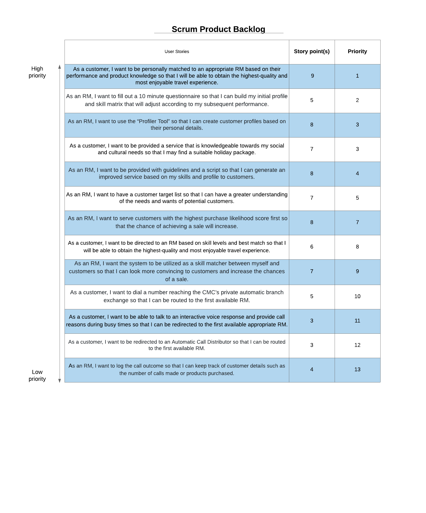
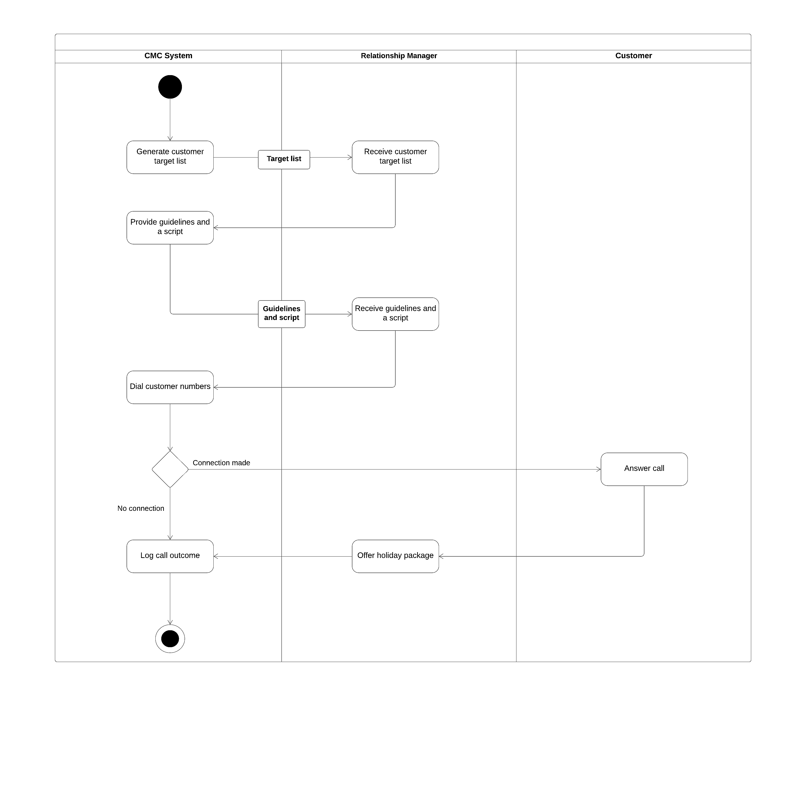

# **_ISDM 'CMC System' Team-3 Report_** 

# Executive Summary

The implementation of a customer processing system was required to improve internal processes and capitalise on individual skills and knowledge of different relationship managers(RM). The scrum framework was adopted for the project to encourage cohesion and communication among developers. 

In the planning process, the problem was first defined, and the objectives outlined. The problem was that the existing system inadequately matched customers to appropriate RMs and the objective was to address this issue by establishing improved call routing. 
From a design thinking approach, various diagrams and models were constructed to encapsulate how the problem could be addressed to achieve the objective. The models consisted of use case diagrams, activity diagrams, class diagrams and collaboration diagrams. Models were tested and redesigned numerous times until the optimal solution was achieved. 

The proposed system, if successful, will help the business establish a competitive advantage in the market and maximise value creation for the customer. However, project failure will cause the business to suffer detrimentally, extensive resources of funds and time would have been wasted and may also damage the business’s reputation. The following report details the process by which the system was designed. 

# The Problem Definition
*Research shows that the current system of operations inadequately matches end-customers to appropriate RMs, leading to unsatisfied customers and a decrease in sales.* 

## Objectives:
1. To develop a new efficient and improved information system for the travel company's in-house *call management centre* (CMC).
2. To improve call routing and dynamic call flow control for both inbound and outbound calls.
3. To implement a supporting tool that will successfully match end-customers to Relationship Managers (RMs).
4. To minimise costs while increasing the efficiency of RMs and inbound calls. 
5. To create an effective system that can continue to operate capably during rush-hour and high intensity periods. 

## Assumptions:
1. It is assumed that the system we are developing is called Call management centre system (CMC System).
2. It is assumed that the current information system supporting the operation of in-house CMC is insufficient in serving customers effectively and efficiently.
3. It is assumed that call routing and dynamic call flow control for both inbound and outbound calls in the current systems of operations is insufficient in serving customers effectively and efficiently.
4. It is assumed that RMs have not been allocated to their appropriate customer and knowledge base, creating inefficiencies and failure of sales in the current system of operations.
5. It is assumed that the current operations do not provide RMs with a proper means of targeting and securing new potential customers.
6. It is assumed that a supporting tool for RMs to create customer profiles exists in the system of operations, under the name “Profiler Tool.”
7. It is assumed that during high intensity periods the system of operations is not proficient enough to provide high quality service towards its customers.
8. It is assumed that the system will log all call outcomes.

## Stakeholders:
- Relationship Managers (user)
- Customers (user)
- Project Manager
- Business Analyst
- Developers/Software Engineers
- Company CEO

## POV Statements: 
_**POV Statement 1**_
- *User:* RMs responsible for performing sales of holiday packages.
- *Need:* An information system to provide a more personalised experience for the customer by facilitating meaningful connections with their client in order to plan the highest-quality and most enjoyable travel experience.
-	*Insight:* The current information system does not adequately match end-customers to well-informed RMs with appropriate experience and product knowledge.

_**POV Statement 2**_
-	*User:* Customers who are in located in Australia and in need of a travel experience. 
-	*Need:* An efficient and quick response from an appropriate RM when calling up the travel company. 
-	*Insight:* The current information system does not provide high-quality service towards its customers during high-intensity times. Customers may hang up if suffering from long wait time; highly inconvenient for customers.

_**POV Statement 3**_
-	*User:* Customers who are in located in Australia and in need of a travel experience. 
-	*Need:* To obtain the best possible holiday package with all travel preferences and criteria satisfactorily fulfilled by the most appropriate and well-informed RM.
-	*Insight:* The current information system does not provide a personalised experience due to inadequate matching of end-customers to RMs.

_**POV Statement 4**_
- *User:* RMs responsible for providing satisfactory customer service. 
- *Need:* A descriptive and accurate profile and skills matrix. 
- *Insight:* The current system does not build or contain any RM profiles failing to direct RMs to customers where their skills can be fully and appropriately utilised.

## HMW Statements: 
-	*How Might We* accurately match an end-customer to a well-informed RM with appropriate experience and product knowledge?
-	*How Might We* provide high-quality service for customers during high-intensity times?
-	*How Might We* reduce long waiting times and prevent customers from hanging up?
-	*How Might We* provide a more personalised experience for our clients?
-	*How Might We* satisfy customer’s travel preferences and criteria?

## Empathy Map:

 

# Design Thinking Approach 

As a team, we have conducted a comprehensive analysis and concluded that the current systems of operations have been inefficient and have resulted in unsatisfied customers and a loss in sales. To resolve this issue, we utilized Scrum methodologies and a design thinking perspective to assist in developing an effective information system that will provide greater assistance to RM’s in matching them with the end-consumers. 

At the start of the project, we established that conducting daily scrums would optimize performance and collaborations and would be vital to the success of this project. Although it was not daily, we decided to have a Zoom Call three times each week, to inspect, update and synchronize each other on our progress and express any issues impeding their performance.

As a team, we collaborated and brainstorm ideas of solutions to the problem. We produced numerous Point of View (POV) statements which reframe the problem through the understanding of the user's needs, wants and the challenges they experience. With these POV statements, it enabled us to explore into a wide range of possibilities and develop How might we (HMW) statements to assist in resolving the problem. In a Zoom meeting, we then discussed these statements and finalized on the most appropriate POV and HMW statements.
Before creating the product backlog, each member was assigned different sections of the case study to create specific user stories based on the facts. We created 13 user stories, where several were based on our assumptions that we created as a group. Some assumptions included that the company’s call management system and ability to match customers with suitable RM are inefficient. These assumptions are projected features or situations that will occur later or during our system’s development and life cycle; they are based on our current knowledge. Through zoom meetings, we conducted multiple meetings on Zoom and created and improved our product backlog through iterations.

Through effective communication, and our open-mind approach to changes and offering valuable feedback and insights of each member’s work, it has allowed for greater collaboration and understanding of the issue. As a result, we continued this approach when generating our prototypes and had progressively improved them through various iterations and finalized each model as a group.

## Product Backlog:

# Workproductss, Models and Descriptions 

## Use Case Diagrams:

### Use Case Diagram 1:This use diagram below demonstrates the function of creating a relationship manager and customer profile.

### Use Case Diagram 2:

### Use Case Diagram 3: 

## Activity Diagrams:

### Activity Diagram 1:

### Activity Diagram 2:

### Activity Diagram 3: 

## Class Diagrams:

A general overview of the system and the relationships between entities. Also describes the responsibilities of the classes in the system. 
 

## Collaboration Diagrams: 

### Collaboration Diagram 1:

### Collaboration Diagram 2:

### Collaboration Diagram 3:

### Collaboration Diagram 4:

# Competitive Advantages and Possible Effects if the Project Fails

A well-designed and executed information system is imperative for businesses to attain a competitive advantage. This is achieved by offering customers greater value than competitors through lower costs or higher quality services. By developing and implementing the proposed system, the operations of the CMC will improve immensely with a focus to accurately match RMs to end-customers with data pertaining an RM’s knowledge and skills. The proposed system will aim to achieve low-cost leadership, product differentiation, target a niche-market, and strengthen customer intimacy. To attain cost leadership the proposed system minimises call costs by effectively matching end-customers to suitable RMs and reducing per-call handling time. The system will generate scores that are calculated based on the RM’s previous call duration and profile, ensuring that customers with the highest scores are served first. The customer target list not only provides an improved service to the end-customer, but it also benefits the call centre by carrying out a more targeted approach ending in more effective calls. The system attains low costs and improved productivity due to an efficient customer response system directly linking appropriate RMs to customers. The use of such a system also enables product differentiation and a niche-market focus, as RMs will provide a more personalised service by assessing customer details, guidelines, and script (target list) from the system. Therefore, strengthening customer relationships with a more intimate and finely tuned sale when serving, and increasing the chances of securing a sale. With customers on their ideal holiday, satisfied customers will highly likely return as repeat customers. Thus, it is evident that both customer satisfaction and retention is achieved through the implementation of the proposed system.

On the other hand, there may be adverse effects upon the travel company in the case that the proposed system fails. After careful analysis, some severe implications include financial loss, time and productivity loss, security issues, and customer turnover. The planning and implementation of a new system requires significant capital and labour. Thus, due to heavily invested capital, failure will result in huge financial impacts not only for capital invested but for time and productivity lost from the interruption of the system failure. Such expenses also contribute to security or privacy issues. Missing or corrupted data that ensues from project failure may risk customer data exposing private information to external threats. Moreover, the failure of the proposed system could mean that customers will be inappropriately matched to RMs with insufficient knowledge about the chosen destination. Customers will ultimately receive unsatisfactory service and may be purchasing a package that does not meet their expectations and needs. This will cause a detrimental impact to the company’s reputation. As a result, an increase in customer turnover and decrease in sales and revenue will occur. Customers will likely not return, and a damaged reputation will deter potential customers from looking to the company for services. Ultimately, it is evident that there are numerous inefficiencies and adverse effects for the company if the project were to fail.

## The Link to the Team's Presentation:

